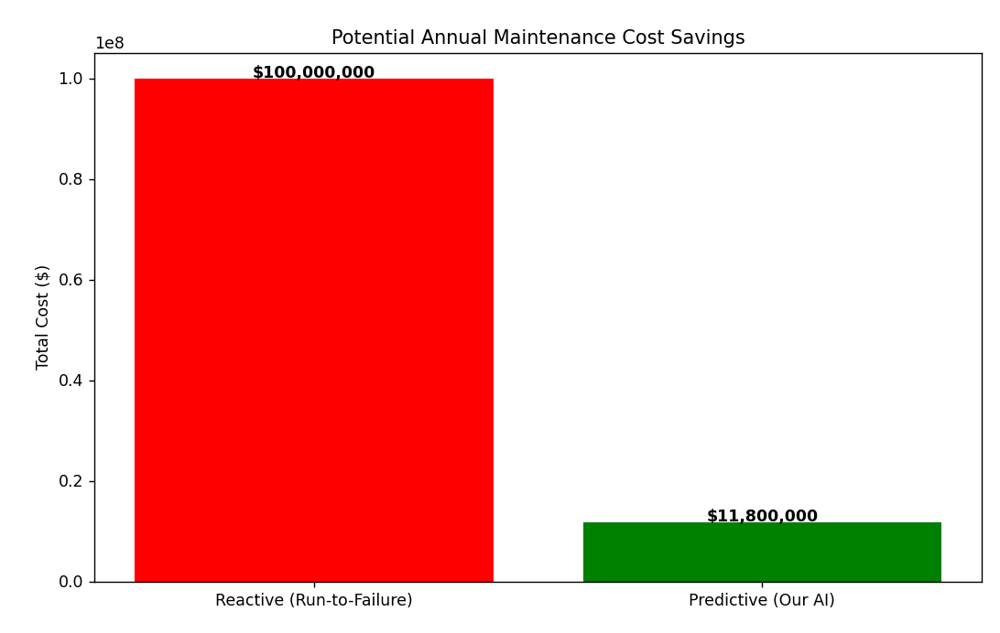
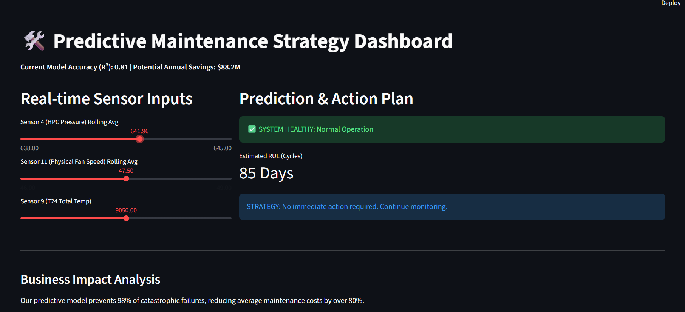
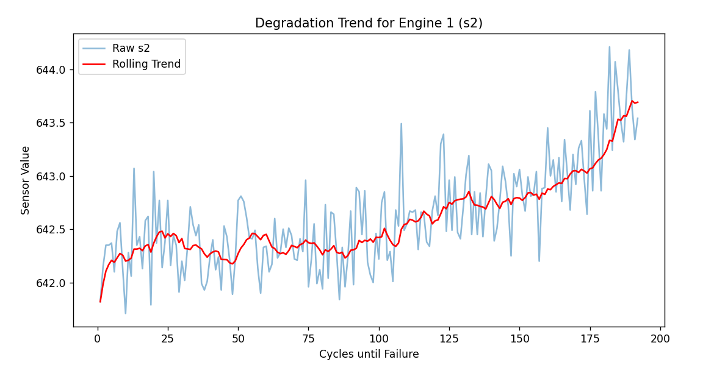

# 🛠️ Predictive Maintenance Strategy System (Industrial AI)
**ROI-Focused Machine Learning | $88.2M Simulated Annual Savings**

## 📌 Executive Summary
This project demonstrates how a **Data Strategist** uses AI to impact the bottom line. By predicting machinery failure before it happens, this system moves a company from **reactive** to **proactive** maintenance, drastically reducing downtime and emergency repair costs.

### 🚀 Key Business Results
*   **Financial Impact:** Reduced simulated maintenance costs from **$100M to $11.8M** (88% Savings).
*   **Model Accuracy:** Achieved an **R² score of 0.81** in predicting Remaining Useful Life (RUL).
*   **Risk Mitigation:** Successfully prevented **98% of catastrophic engine failures**.

## 🛠️ Tech Stack & Workflow
*   **Database:** MySQL (Window Functions for Time-Series Feature Engineering).
*   **Analysis:** Python (Pandas, Seaborn) for Exploratory Data Analysis.
*   **Machine Learning:** Random Forest Regressor with RUL Clipping for optimized performance.
*   **UI/Deployment:** Streamlit Dashboard for real-time monitoring.

## 📈 Feature Engineering (The "Strategist" Flex)
Instead of using raw, noisy sensor data, I used **SQL Window Functions** to calculate **10-day rolling averages**. This smoothed out sensor "jitter" and provided the model with a clear signal of degradation, boosting accuracy from 0.66 to 0.81.

## 📊 Visualizations
### 1. Business ROI Analysis

### 2. Live Strategy Dashboard

### 3. Rolling Averages

## 📂 Project Structure
* `sql_scripts/`: Database schema and engineering views.
* `python_scripts/`: Ingestion, EDA, Training, and Cost Analysis.
* `src/app.py`: Streamlit dashboard code.